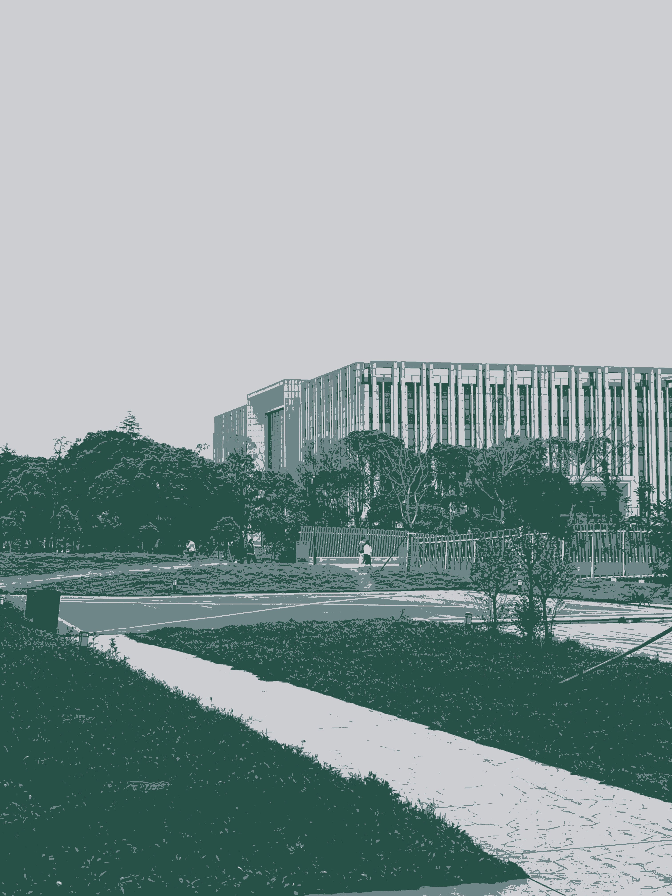
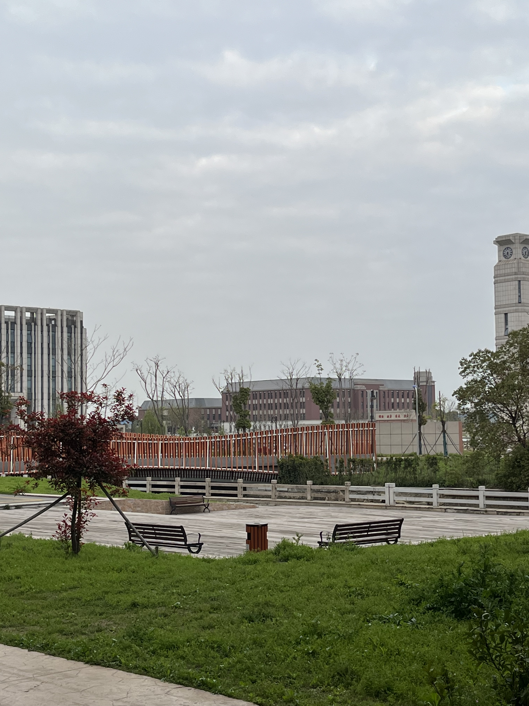

#计算机视觉第一周作业实验报告
## 任务一：基于聚类的图像分割
### 1.1 聚类算法
聚类算法是一种无监督学习算法，其目的是将数据集中的样本划分为若干个类别，使得同一类别中的样本具有较高的相似度，而不同类别中的样本具有较低的相似度。聚类算法的主要应用场景是数据挖掘、图像分割、文本分类等。聚类算法的主要思想是通过计算样本之间的相似度，将相似度较高的样本划分到同一类别中。聚类算法的主要步骤如下：
1. 随机初始化聚类中心
2. 计算每个样本与聚类中心的相似度
3. 将每个样本划分到相似度最高的聚类中心所在的类别中
4. 重新计算每个类别的聚类中心
5. 重复步骤2-4，直到聚类中心不再发生变化
### 1.2 K-Means算法
K-Means算法是一种基于聚类的图像分割算法，其主要思想是将图像中的像素点划分为K个类别，使得同一类别中的像素点具有较高的相似度，而不同类别中的像素点具有较低的相似度。K-Means算法的主要步骤如下：
1. 随机初始化K个聚类中心
2. 计算每个像素点与聚类中心的相似度
3. 将每个像素点划分到相似度最高的聚类中心所在的类别中
4. 重新计算每个类别的聚类中心
5. 重复步骤2-4，直到聚类中心不再发生变化
### 1.3 K-Means算法的优缺点

K-Means算法的优点如下：
1. 算法简单，易于实现
2. 算法收敛速度快

K-Means算法的缺点如下：
1. 算法对噪声敏感
2. 算法对异常值敏感
### 1.4 基于K-Means算法的图像分割结果

上方图像为原始图像，下方图像为基于K-Means算法的图像分割结果。

##任务二：图像拼接
### 2.1 实验目标
1. 理解关键点检测算法DOG的原理
2. 理解尺度变化不变特征SIFT的原理
3. 采集一系列图像，自行设计图像拼接算法
4. 使用Python实现图像拼接算法

### 2.2 具体要求
1. 不允许使用现有的图像拼接算法
2. 在图像采集过程中尽可能减少相机在垂直方向的移动，但不能假设相机只在水平方向移动
3. 需要包含图像融合的过程，从而减少拼接后的图像中的缝隙
   
### 2.3 实验结果

上面的图像中，第一张和第二张图像为原始图像，第三张和第四张图像为关键点检测的结果，第五张图像为图像拼接的结果。