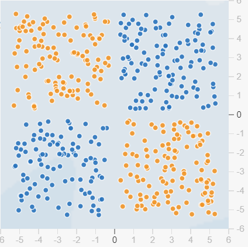
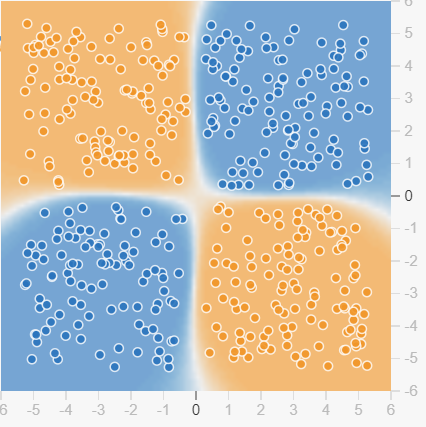
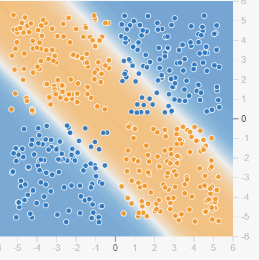
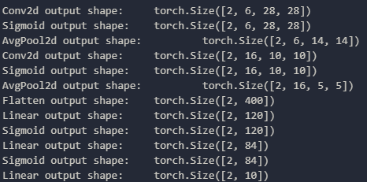
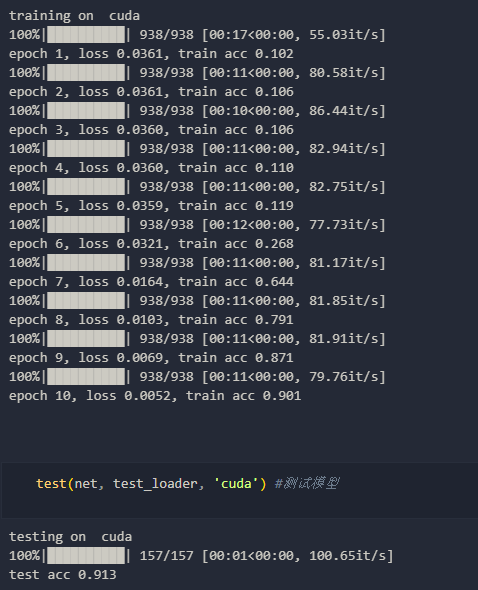

#计算机视觉第二周实验报告
##实验一:使用TensorFlow Playground
TensorFlow Playground是一个交互式的神经网络可视化工具，可以用来学习神经网络的基本概念。在这个实验中，我们将使用TensorFlow Playground来学习神经网络的基本概念。
###实验步骤
1. 打开TensorFlow Playground网站，点击左侧的“Playground”按钮，进入实验界面。
2. 可以看到，TensorFlow Playground的界面分为三个部分：左侧是神经网络的可视化图，中间是神经网络的参数设置，右侧是神经网络的训练过程。注意，该网站仅能用于可视化全连接网络，不能用于卷积神经网络。蓝色样本点表示正例，红色样本点表示负例。
###实验结果
1. 选择“XOR”数据集。
2. 设置网络的深度和神经元的个数
3. 开始训练，观察结果。

可以观察到，当网络的深度和神经元的个数设置为1时，网络无法学习到XOR的分类边界。当网络的深度和神经元的个数设置为2时，网络可以学习到XOR的分类边界。

##实验二:使用LeNet-5进行MNIST手写数字识别
LeNet-5是Yann LeCun等人在1998年提出的卷积神经网络，是当时最先进的卷积神经网络。在这个实验中，我们将使用LeNet-5来识别MNIST手写数字数据集。
###实验步骤
1. 下载MNIST数据集。
2. 对数据集进行预处理。
3. 搭建LeNet-5网络。
4. 设置网络的超参数。
5. 训练网络。
###实验结果
Lenet-5网络的结构如下图所示:

实验显示，LeNet-5网络在MNIST数据集上的准确率为91.3%。，比之前的全连接网络的准确率提高了约2%。
